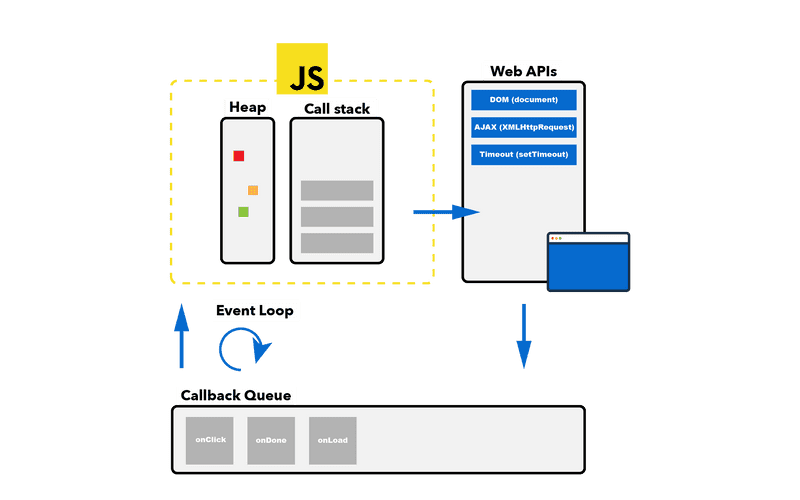

[&#8678; get back to the start...](../README.md)
# Callback & Event Loop
## Callback
```js
const getToDo = ((callback) => {
  fetch('https://jsonplaceholder.typicode.com/todos/1')
    .then((response) => response.json())
    .then((todo) => {
      callback(todo);
    })
    .catch((error) => console.log(error));
});

getToDo((todo) => {
  console.log(todo);

  getToDo((todo) => {
    console.log(todo);

    getToDo((todo) => {
      console.log(todo);
    });
  });
});
```

## Event Loop
## Call Stack, Callback queue
1. Macrotasks (all script)
2. Microtasks queue (.then/catch/finally)
3. Callback queue (setTimeont, intervalTimiout)
```js
function sayHello(name) {
  console.log(`Hello, ${name}!`);
}
console.log('start');
sayHello('Max');
setTimeout(() => {
  sayHello('William from setTimeout');
}, 0);
sayHello('John');
sayHello('Bob');
console.log('finish');

//start
// Hello, Max!
// Hello, John!
// Hello, Bob!
// finish
// Hello, William from setTimeout!
```


### Microtasks & Macrotasks
Execution of .then/catch/finally handler becomes a microtask
```js
console.log('Let\'s start');

setTimeout(() => {
  console.log('Hi, I\'m setTimeout in one second.');
}, 1000);

const promise = new Promise((resolve) => {
  console.log('Hello, I\'m Promise.');
  resolve('Resolve result of Promise.');
});

setTimeout(() => {
  console.log('Hi, I\'m setTimeout in two seconds.');
}, 2000);

promise
  .then((result) => console.log(result))
  .catch((error) => console.log(error))
  .finally(() => console.log('Finally!'));

console.log('Finish!');

// microtasks.js:1  Let's start
// microtasks.js:8  Hello, I'm Promise.
// microtasks.js:18 Finish!
// microtasks.js:16 Resolve result of Promise.
// microtasks.js:19 Finally!
// microtasks.js:4  Hi, I'm setTimeout in one second.
// microtasks.js:13 Hi, I'm setTimeout in two seconds.
```